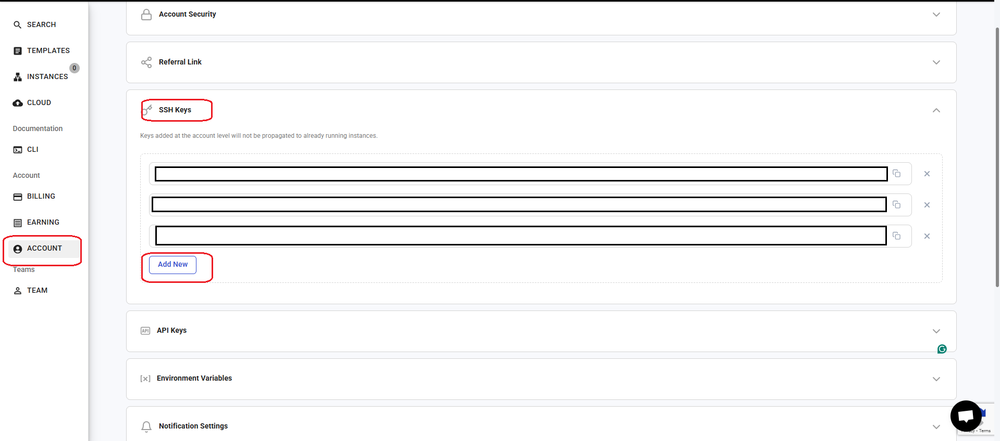
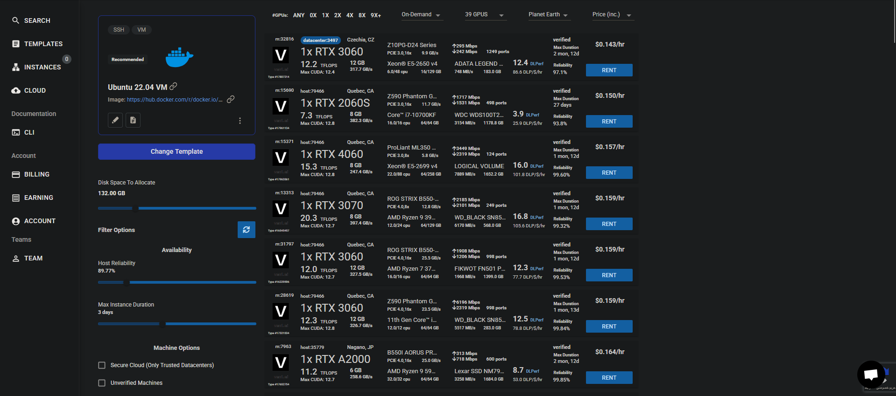

## Before We Begin

Fist we should prepare our tools

We need these tools:

## Our Refrences As our Guide

*   [Fine-Tuning Stable Diffusion with LoRA](https://machinelearningmastery.com/fine-tuning-stable-diffusion-with-lora) (Webpage)
*   [Fine-Tune Stable Diffusion with LoRA for as Low as $1](https://youtu.be/Zev6F0T1L3Y?t=458) (Video)
*   [Pokémon Dataset](https://huggingface.co/datasets/svjack/pokemon-blip-captions-en-zh) (Dataset)
*   [Diffusers GitHub Repository](https://github.com/huggingface/diffusers/) (GitHub)
*   [How to Fine-Tune with LoRA by Hugging Face](https://huggingface.co/docs/diffusers/en/training/lora) (Documentation)

## Tools
* [A GPU server](https://vast.ai) -  To run our Cods. In our journy we use [vast.ai](https://vast.ai)
* [Putty](https://www.putty.org/) - We need putty to conect to server by SSH
* [WinASP](https://winscp.net/eng/download.php) - To filetransfer easily between server and local PC
* Creatin account on [HuggingFace](https://huggingface.co/)
* Python 3

## Connect to Server
### Log-in to the server
Go to [https://cloud.vasi.at](https://cloud.vasi.at). Obviously you should have register anc charge you account.

### Creating a SSH connection
Install puty Putty](https://www.putty.org/) as mentioned on your PC. (Ubuntu or MAC users would not need this. ALso you can use PowerShell in Microsoft Windows but its recommended to use Putty).
Wath video below. You need to create a **ssh key **with **puttygen**.

After that you should add you public key to **vast** account as below:

m

### Slecting a Server

After loggin into server you will see an enviroment such the following image:

At top left side you should choose your template. It is recommended to select **Ubuntu 22.04**. Other wise select any you want. At the right side you can choose your GPU. In trining and testing phase, **Nvidia RTX Series** are good choices. Espesially **RTX3070**, **RTX3060**, and **RTX3090** depend on your required calculations.

There are two types of servers available. **On-demand** and **interuptable**. Which highly **on-demand** is recommended tue to **interuptable** servers may be interrupt duting the connection. 
After selecting you server press **RENT**.
Then you redirect to a page look like the following.